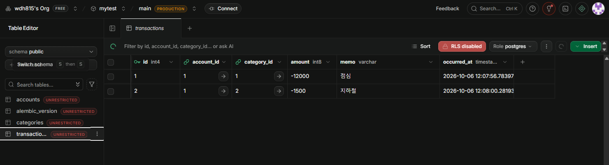
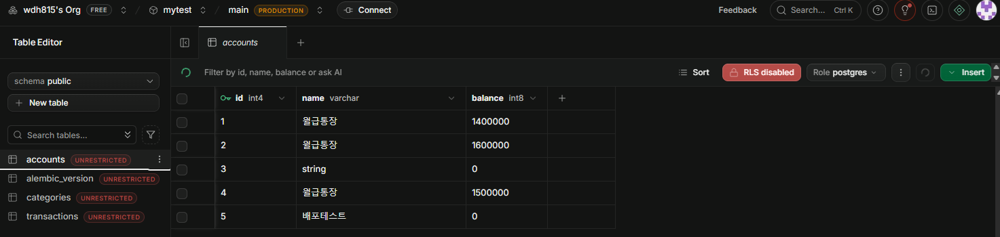

GitHub: https://github.com/wdh815/ledger-api · Render: https://ledger-api-piaz.onrender.com/docs

# 가계부 API — FastAPI + Supabase(PostgreSQL)

클라우드컴퓨팅실습 4주차 실습 (교재 04 「FastAPI와 PostgreSQL 백엔드 실습」).
FastAPI + SQLAlchemy 2.0으로 계좌·카테고리·거래를 Supabase(클라우드 PostgreSQL)에 저장·조회·집계하고, Render에 배포했다.

```
요청 → FastAPI(Render) → SQLAlchemy(ORM) → PostgreSQL(Supabase, Session pooler :5432)
```

## 파일 구성

| 파일 | 역할 |
|---|---|
| `database.py` | Engine · SessionLocal · Base · `get_db` (`DATABASE_URL` 환경변수로 접속) |
| `models.py` | 테이블 3개: `accounts` · `categories` · `transactions` (FK + relationship) |
| `schemas.py` | Pydantic 입출력 스키마 (중첩 응답 `AccountReadWithTx` 포함) |
| `main.py` | API 경로 |
| `alembic/` | 마이그레이션 (baseline 버전) |
| `requirements.txt` | 배포 시 Render가 설치하는 패키지 목록 |

## API 명세

| 메서드 | 경로 | 설명 |
|---|---|---|
| POST | `/accounts` | 계좌 생성 |
| GET | `/accounts` | 계좌 목록 |
| GET | `/accounts/{account_id}` | 계좌 단건 |
| POST | `/transactions` | 거래 생성 (없는 계좌면 404) |
| GET | `/accounts/{account_id}/detail` | 계좌 + 거래 목록 중첩 응답 |
| GET | `/stats/by-category` | 카테고리별 지출 합계 (GROUP BY) |
| POST | `/transfers?from_id=&to_id=&amount=` | 이체 — 출금·입금을 한 트랜잭션으로 (확장) |
| GET | `/accounts-with-tx` | selectinload로 N+1 해결 (확장) |

## 로컬 실행

```bash
python -m venv .venv
.venv\Scripts\activate          # macOS: source .venv/bin/activate
pip install -r requirements.txt
# .env 에 DATABASE_URL=postgresql+psycopg://postgres.<ref>:<비밀번호>@aws-0-<region>.pooler.supabase.com:5432/postgres
uvicorn main:app --reload
```

Render 설정: Build `pip install -r requirements.txt` · Start `uvicorn main:app --host 0.0.0.0 --port $PORT` · 환경변수 `DATABASE_URL`.

## 실습 기록

### ① 결과 확인

**Supabase Table Editor — `transactions`** (API로 넣은 거래 2건)



**Supabase Table Editor — `accounts`** (id 5 「배포테스트」는 Render 배포 주소에서 POST로 생성)



- 로컬 API로 넣은 거래 2건(점심 -12,000 / 지하철 -1,500)이 Supabase `transactions` 테이블에 저장됨.
- `GET /accounts/1/detail` → 계좌 1에 거래 2건이 중첩되어 반환됨.
- `GET /stats/by-category` → `[{"category":"교통","total":-1500,"count":1},{"category":"식비","total":-12000,"count":1}]`
- `POST /transfers?from_id=1&to_id=2&amount=100000` → 계좌1 1,500,000→1,400,000 / 계좌2 1,500,000→1,600,000.
- 배포 후 Render `/docs`의 `GET /accounts`가 로컬에서 만든 Supabase 계좌(id 1~4)를 그대로 반환하고, Render에서 `POST /accounts`로 만든 「배포테스트」(id 5)가 Supabase `accounts` 테이블에 바로 나타나는 것을 확인.

### ② 핵심 개념 되새김
- **계좌·거래를 두 테이블로 나눈 이유(1:N)**: 한 계좌에 거래가 여러 건 붙으므로, 거래는 계좌 id(외래키)만 가리키게 해서 계좌 정보 중복을 없애고 "없는 계좌의 거래"를 DB가 막도록 했다.
- **모델 클래스 ↔ 테이블**: `class Account(Base)` 하나가 `accounts` 테이블 하나이고, `Mapped[str]`은 NOT NULL, `Mapped[str | None]`은 NULL 허용 컬럼, `ForeignKey`는 외래키 제약이 된다.
- **접속 문자열을 .env로 분리하는 이유**: 비밀번호가 들어 있어 코드·GitHub에 남기면 안 되고, 로컬(.env)과 운영(Render 환경변수)이 달라도 코드는 그대로 `os.getenv("DATABASE_URL")`로 읽으면 된다.

### ③ 자유 로그
- SQLite(ledger-sql)로 CREATE·INSERT·JOIN·GROUP BY·트랜잭션 롤백을 먼저 확인한 뒤, 같은 구조를 SQLAlchemy 모델로 옮겨 Supabase에 연결했다.
- Supabase는 Direct(IPv6 전용)가 아니라 **Session pooler(5432)** 주소를 쓰고, 앞머리를 `postgresql+psycopg://`로 바꿔야 psycopg2 오류가 나지 않는다.
- Windows Git Bash의 curl로 한글 JSON을 보내면 인코딩이 깨져 "error parsing the body"가 났다 → 서버 문제가 아니라 클라이언트 인코딩 문제였고, 파이썬(UTF-8)으로 보내니 정상 처리됐다.
- Alembic baseline은 이미 create_all로 테이블이 있어 `pass`뿐인 빈 마이그레이션이 생성됨을 확인(drop_table 없음)한 뒤 `upgrade head` 적용. 이후 `main.py`의 `create_all`은 주석 처리.
- AI(Claude Code)에게 워크북 단계 진행·코드 작성·배포를 맡겼고, 각 단계의 "확인" 항목(엔드포인트 응답, Supabase 테이블 행, alembic current 출력)을 직접 실행 결과로 대조해 검증했다.
